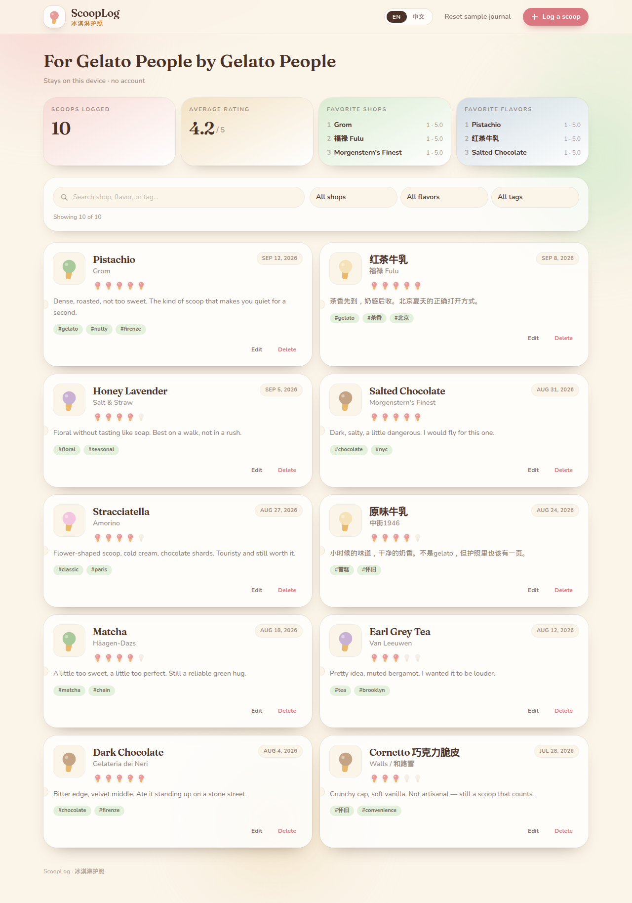

# ScoopLog · 冰淇淋护照

**For Gelato People by Gelato People.**

A local-first personal ice cream journal for people who love *eating* scoops —
not running a shop, not formulating a mix. Open the passport, stamp the gelato
you actually ate, and keep the memory on this device.

[Features](#features) · [Quick start](#quick-start) · [中文](#冰淇淋护照)



## Why ScoopLog

Most “ice cream” software is built for parlors. ScoopLog is built for the other
side of the counter: the walk home with a cone, the pistachio that made you go
quiet, the supermarket Cornetto that still counts.

- **Local-first.** Entries live in `localStorage`. No account, no server.
- **Bilingual.** English and 中文, switch anytime. Preference is remembered.
- **Small on purpose.** Shop, flavor, 1–5 rating, optional notes, date, tags.

## Features

- List scoops, most recent first
- Add, edit, and delete a scoop
- Search and filter by shop, flavor, or tag
- Stats: total scoops, average rating, favorite shops and flavors
- Sample journal on first visit, plus a one-click reset
- Warm cream / pastel UI that works on a phone and a desktop

## Quick start

Need **Node.js 20+**.

```bash
git clone https://github.com/WhitterWang/scooplog.git
cd scooplog
npm install
npm run dev
```

Open the local Vite URL. To ship a static build:

```bash
npm run build
npm run preview
```

## Stack

Vite · React · TypeScript · Tailwind CSS. MIT licensed.

## Contributing

Please read [CONTRIBUTING.md](CONTRIBUTING.md) and the
[Code of Conduct](CODE_OF_CONDUCT.md). Bugs and ideas go through
[GitHub issues](https://github.com/WhitterWang/scooplog/issues).

---

# 冰淇淋护照

**为爱冰淇淋的人，由爱冰淇淋的人。**

ScoopLog 是一本只存在于你浏览器里的冰淇淋日记：给爱*吃*冰淇淋的人，
不是给店主，也不是给调配方的人。记下店铺、口味、评分，盖上属于你的一页。


## 为什么做它

多数冰淇淋软件是给店里用的。护照是给柜台上另一边的人：走在回家路上的甜筒，
那口让你突然安静的开心果，以及依然值得记上一笔的超市脆皮筒。

- **本地优先。** 数据写在 `localStorage`，没有账号，也没有服务器。
- **中英双语。** 随时切换，语言选择会记住。
- **够用就好。** 店铺、口味、1–5 分，可选笔记、日期、标签。

## 功能

- 按时间倒序浏览每一勺
- 新增、编辑、删除
- 按店铺、口味、标签搜索和筛选
- 统计：总数、平均分、最爱店铺与口味
- 首次进入带示例数据，也可一键重置
- 奶油色、粉彩色，手机和桌面都好看

## 快速开始

需要 **Node.js 20+**。

```bash
git clone https://github.com/WhitterWang/scooplog.git
cd scooplog
npm install
npm run dev
```

在浏览器打开 Vite 提示的地址。生产构建：

```bash
npm run build
npm run preview
```

## 技术栈

Vite · React · TypeScript · Tailwind CSS。采用 MIT 许可。

欢迎阅读 [CONTRIBUTING.md](CONTRIBUTING.md) 与
[行为准则](CODE_OF_CONDUCT.md)，并通过
[GitHub Issues](https://github.com/WhitterWang/scooplog/issues) 反馈。
